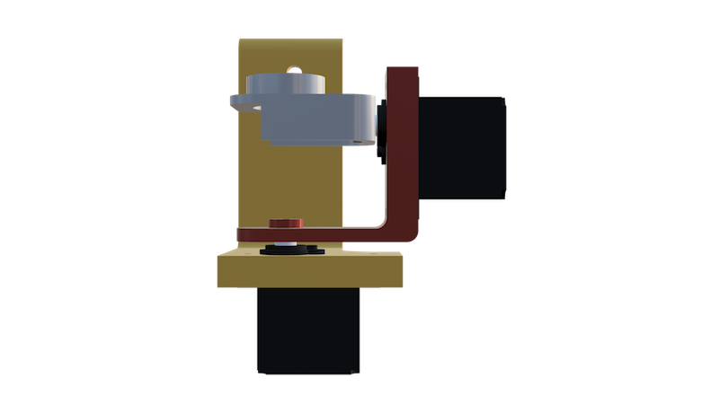
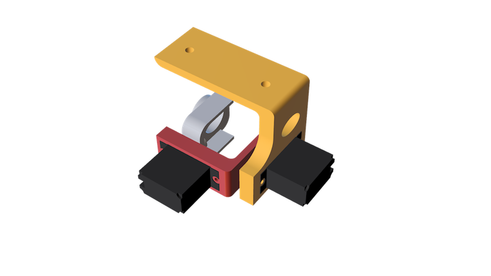

# Gimbal for Phantom

This is a quick and dirty gimbal that I made for the DJI Phantom 1.
You will need two 9g servos.  I used Towerpro SG90 – they were a bit
jerky, but worked surprisingly well in flight.

These connect directly to the flight controller.  I don't have the
documentation for that handy, but it wasn't hard to figure out.  

The software needed to configure and tune gimbal, as well as some
documentation, should be available from [DJI's Phantom 1 website](https://www.dji.com/product/phantom/download?viewClass=Print&www=v1&pbc=mF6h4ZTt)

 

